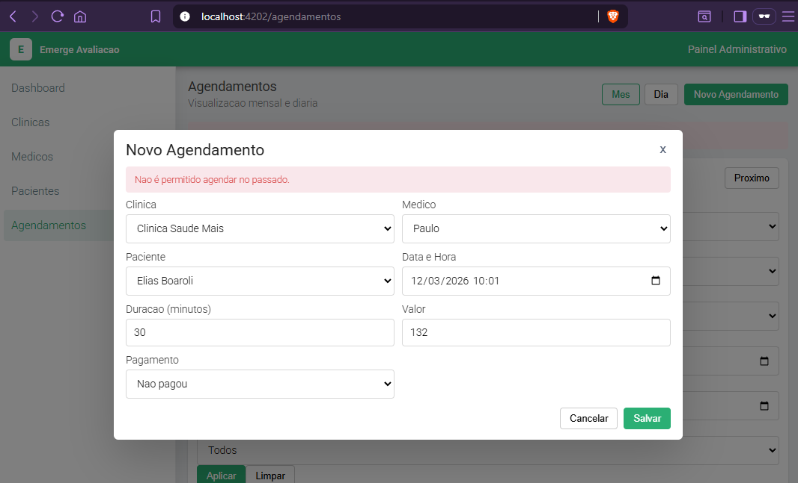
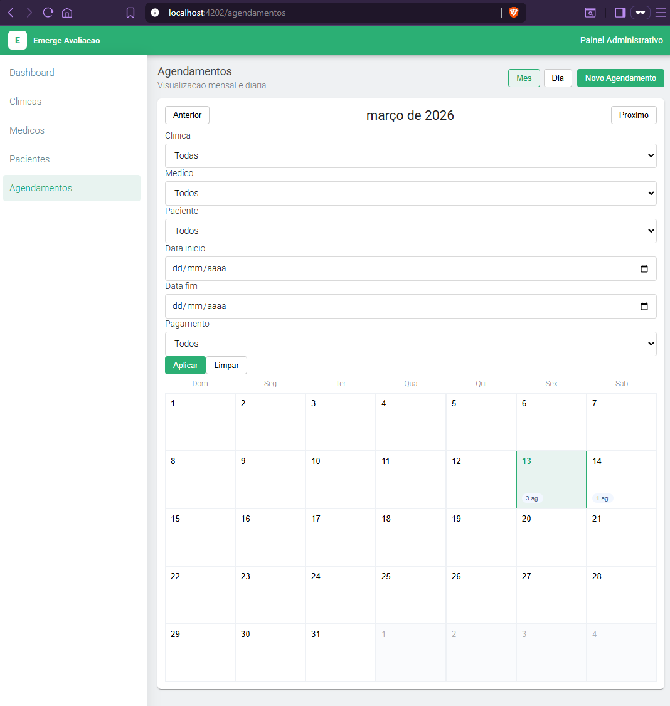
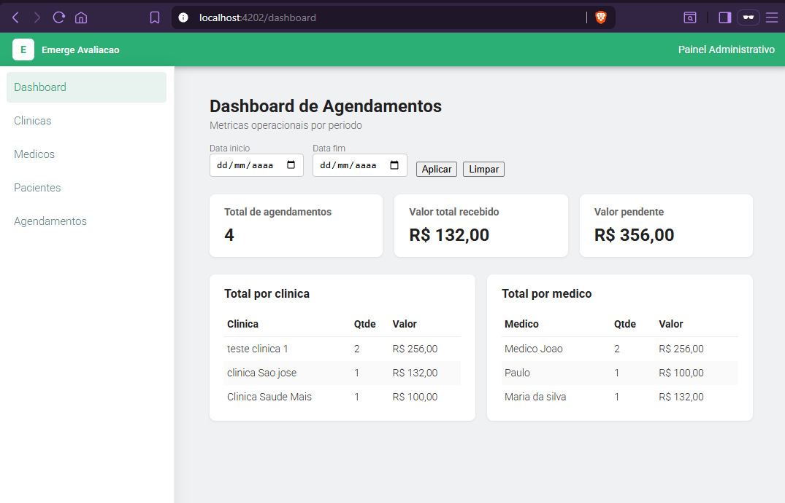

# Documentacao das Tarefas – Avaliacao Tecnica

Este arquivo descreve as implementacoes realizadas nas tarefas da avaliacao tecnica, tanto no backend (NestJS + MongoDB) quanto no frontend (Angular).

---

## Tarefa 01 – Validacoes de Agendamento

**Objetivo:** adicionar validacoes de negocio no cadastro de agendamentos.

### Backend (NestJS)

Arquivos:
- `server/src/modules/agendamentos/dto/create-agendamento.dto.ts`
- `server/src/modules/agendamentos/agendamentos.service.ts`

Implementacoes:

- **Data/hora no passado**
  - Metodo privado `validateBusinessRules` em `AgendamentosService` confere se `dataHora` é anterior ao momento atual.
  - Em caso invalido, lanca:
    - `BadRequestException('Nao é permitido agendar no passado.')`.

- **Duracao do agendamento**
  - `CreateAgendamentoDto`:
    - `duracaoMinutos` anotado com:
      - `@Min(15, { message: 'Duracao (minutos) deve ser no minimo 15.' })`
      - `@Max(240, { message: 'Duracao (minutos) deve ser no maximo 240.' })`
  - Garante duracao entre 15 e 240 minutos, com mensagens claras em portugues.

- **Valor do agendamento**
  - No DTO:
    - `valor` anotado com `@Min(0)` e `@Max(999999.99)` para impedir valores negativos.
  - Em `validateBusinessRules`:
    - Verifica se o valor possui no maximo 2 casas decimais.
    - Se nao, lanca:
      - `BadRequestException('Valor deve ter no maximo 2 casas decimais.')`.

- **Integração no fluxo**
  - `validateBusinessRules` é chamado em:
    - `create(createAgendamentoDto)`
    - `update(id, updateAgendamentoDto)`
  - Violacoes retornam HTTP 400 com mensagens descritivas.

### Frontend (Angular)

Arquivos:
- `web/src/app/pages/agendamentos-page.component.ts`
- `web/src/app/pages/agendamentos-page.component.html`

Implementacoes:

- **Validacoes no formulario reativo**
  - Form de agendamento:
    - `duracaoMinutos`: `Validators.min(15)`, `Validators.max(240)`.
    - `valor`: `Validators.min(0)`.

- **Tratamento de erros da API**
  - Metodo `save()` inspeciona `err.error.message` na resposta de erro.
  - Se vier um array de mensagens (class-validator), concatena; se vier string (regras de negocio), usa diretamente.
  - Armazena em `this.error` e exibe:
    - no topo da pagina de agendamentos;
    - e dentro da modal de criacao/edicao de agendamento.

---

## Tarefa 02 – Filtros de Listagem (Agendamentos)

**Objetivo:** criar filtros de busca para a listagem de agendamentos.

### Backend (NestJS)

Arquivos:
- `server/src/modules/agendamentos/dto/filter-agendamento.dto.ts`
- `server/src/modules/agendamentos/agendamentos.controller.ts`
- `server/src/modules/agendamentos/agendamentos.service.ts`

Implementacoes:

- **DTO de filtros (`FilterAgendamentoDto`)**
  - Filtros opcionais recebidos via query string:
    - `clinicaId?: string`
    - `medicoId?: string`
    - `pacienteId?: string`
    - `dataInicio?: string` (ISO ou `yyyy-MM-dd`)
    - `dataFim?: string`
    - `pagou?: string` (`'true'` / `'false'`)
  - Usa `class-validator` para validacao basica (`@IsMongoId`, `@IsDateString`, `@IsBooleanString`, `@IsOptional`).

- **Controller**
  - Metodo `findAll(@Query() filters: FilterAgendamentoDto)`:
    - Encaminha os filtros para o service.

- **Service**
  - `findAll(filters: FilterAgendamentoDto)` monta dinamicamente um `query` para o Mongoose:
    - `clinicaId`, `medicoId`, `pacienteId` → filtros diretos.
    - `dataInicio`/`dataFim` → monta `query.dataHora` com `$gte` e `$lte`.
    - `pagou` → converte `'true'`/`'false'` para boolean e filtra.
  - Executa:
    - `this.agendamentoModel.find(query).populate(...).sort({ dataHora: 1 }).exec();`

### Frontend (Angular)

Arquivos:
- `web/src/app/core/crud-api.service.ts`
- `web/src/app/pages/agendamentos-page.component.ts`
- `web/src/app/pages/agendamentos-page.component.html`

Implementacoes:

- **Servico de API (`CrudApiService`)**
  - Metodo `list(entity: EntityType, params?: Record<string, any>)`:
    - Monta `HttpParams` a partir de `params`.
    - Chama `GET {apiUrl}/{entity}` incluindo os filtros.

- **Estado de filtros na tela**
  - `filtersForm` em `AgendamentosPageComponent`:
    - `clinicaId`, `medicoId`, `pacienteId`, `dataInicio`, `dataFim`, `pagou`.
  - Metodo `buildFilterParams()`:
    - Lê valores do `filtersForm`.
    - Retorna apenas chaves preenchidas para mandar na query string.
  - `loadAll()`:
    - Carrega `clinicas`, `medicos`, `pacientes`.
    - Chama `this.api.list('agendamentos', params)` usando o resultado de `buildFilterParams()`.

- **Ações de filtro**
  - `applyFilters()` apenas chama `loadAll()`.
  - `clearFilters()` reseta o `filtersForm` e recarrega sem filtros.

- **UI de filtros**
  - Barra de filtros acima do calendario, com:
    - selects para Clínica, Médico, Paciente;
    - campos `Data inicio` e `Data fim`;
    - select de `Pagamento` (Todos / Pagos / Não pagos);
    - botões “Aplicar” e “Limpar”.
  - Filtros são aplicados sem recarregar a pagina, atualizando só a lista de agendamentos.
  - O `filtersForm` não é resetado ao alternar entre visualizacao Mes/Dia, mantendo os filtros ativos.

  
---

## Tarefa 03 – Dashboard de Indicadores

**Objetivo:** criar um painel com metricas operacionais de agendamentos.

### Backend (NestJS)

Arquivos:
- `server/src/modules/agendamentos/dto/dashboard-agendamento.dto.ts`
- `server/src/modules/agendamentos/agendamentos.controller.ts`
- `server/src/modules/agendamentos/agendamentos.service.ts`

Implementacoes:

- **DTO de periodo (`DashboardAgendamentoDto`)**
  - Campos opcionais `dataInicio` e `dataFim` para filtrar por intervalo.

- **Endpoint**
  - `GET /agendamentos/dashboard`:
    - Controller: `getDashboard(@Query() filtro: DashboardAgendamentoDto)`
    - Service: `getDashboard(filtro)`.

- **Calculos de indicadores no service**
  - Usa `aggregate` com `$match` em `dataHora` quando ha `dataInicio`/`dataFim`.
  - Calcula:
    - `totalAgendamentos` – quantidade de agendamentos no periodo.
    - `valorTotalRecebido` – soma de `valor` onde `pagou = true`.
    - `valorPendente` – soma de `valor` onde `pagou = false`.
  - Totais por entidade:
    - **Clinica**:
      - Agrupa por `clinicaId` (string).
      - Converte o id agrupado para `ObjectId` (`$toObjectId`) em `clinicaIdObj`.
      - Faz `$lookup` na collection `clinicas` para obter o `nome`.
      - Retorna `{ clinicaId, nomeClinica, total, valor }`.
    - **Medico**:
      - Mesma logica, usando `medicoId`, `medicoIdObj`, `$lookup` em `medicos` e `nomeMedico`.

- **Contrato de resposta**
  - Objeto com:
    - `totalAgendamentos`
    - `valorTotalRecebido`
    - `valorPendente`
    - `totalPorClinica`: array de `{ clinicaId, nomeClinica, total, valor }`
    - `totalPorMedico`: array de `{ medicoId, nomeMedico, total, valor }`

### Frontend (Angular)

Arquivos:
- `web/src/app/core/crud-api.service.ts`
- `web/src/app/pages/dashboard-page.component.ts`
- `web/src/app/pages/dashboard-page.component.html`
- `web/src/app/pages/dashboard-page.component.scss`
- `web/src/app/app.routes.ts`
- `web/src/app/app.component.html`

Implementacoes:

- **Servico de API**
  - Metodo `getAgendamentosDashboard(params?: Record<string, any>)`:
    - Monta `HttpParams` com `dataInicio`/`dataFim` quando informados.
    - Chama `GET {apiUrl}/agendamentos/dashboard`.

- **Componente de dashboard (`DashboardPageComponent`)**
  - Interface `DashboardIndicadores` alinhada ao backend.
  - Signals:
    - `loading`, `error`, `indicadores`.
  - `filtroForm` com `dataInicio` e `dataFim`.
  - `loadIndicadores()`:
    - Lê o periodo do form.
    - Chama `getAgendamentosDashboard`.
    - Armazena o resultado em `indicadores`.
  - `limparFiltro()`:
    - Reseta o periodo e recarrega a API.
  - `formatCurrency()` para exibir valores em `pt-BR`.

- **Template**
  - Barra de filtro por período com inputs de data + botões Aplicar/Limpar.
  - Cards de indicadores:
    - Total de agendamentos.
    - Valor total recebido.
    - Valor pendente.
  - Tabelas:
    - **Total por clinica**:
      - Colunas: Clinica, Qtde, Valor.
      - Exibe `nomeClinica` (fallback para `clinicaId`).
    - **Total por medico**:
      - Colunas: Medico, Qtde, Valor.
      - Exibe `nomeMedico` (fallback para `medicoId`).

- **Navegacao**
  - Rota `/dashboard` adicionada em `app.routes.ts`.
  - Item “Dashboard” no menu lateral (`app.component.html`) apontando para essa rota.

  
---

## Conclusão
  - NodeJs (NestJS) é bem parecido com C# .NET, ambos seguem mesmo paradigma de APIs REST em camadas.
  - NestJS lembra muito ASP.NET Core. Em ambos boa parte do trabalho é desenhar contratos (DTOs), aplicar as regras de negocio em serviços e centralizar configuracoes.
  - O banco tambem tem suas diferenças por ser NoSQL. A ideia de model + consultas tipadas é similar, mas o modelo de dados de documento vs tabela muda a forma de pensar joins. Aqui tem que fazer $lookup em vez de include/JOIN. (Pelo menos da forma que encontrei pra fazer, pode haver outras.)
  - Em resumo as ideias e paradigmas são quase idênticos; o que muda são detalhes de sintaxe, nomes de classes e bibliotecas.

---
